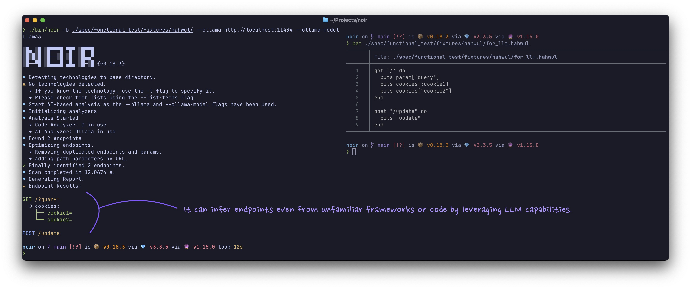

+++
title = "AI-Powered Analysis"
description = "Learn how to use Noir's AI integration to get advanced analysis of your code. This guide covers the necessary flags and options for connecting to LLM providers like OpenAI, xAI, and local models."
weight = 4
sort_by = "weight"

[extra]
+++

Noir can connect to Large Language Models (LLMs)—both cloud-based services and local instances—to provide a deeper level of analysis for your codebase. By leveraging AI, Noir can often identify endpoints in languages and frameworks that it doesn't natively support, and can provide additional insights into the functionality of your application.



## How to Use the AI Integration

To enable AI-powered analysis, you need to specify an AI provider, a model, and an API key.

```bash
noir -b . --ai-provider <PROVIDER> --ai-model <MODEL_NAME> --ai-key <YOUR_API_KEY>
```

### Command-Line Flags

*   `--ai-provider`: The AI provider you want to use. This can be a preset prefix (like `openai` or `ollama`) or the full URL of a custom API endpoint.
*   `--ai-model`: The name of the model you want to use for the analysis (e.g., `gpt-4o`).
*   `--ai-key`: Your API key for the AI provider. You can also set this using the `NOIR_AI_KEY` environment variable.
*   `--ai-max-token`: (Optional) The maximum number of tokens to use for AI requests. This can affect the length of the generated text.
*   `--cache-disable`: Disable the on-disk LLM cache for this run.
*   `--cache-clear`: Clear the LLM cache directory before the run.

By default, Noir caches AI responses on disk to speed up repeated analyses and reduce costs. Use the cache flags above to bypass or purge the cache when needed.

### Supported AI Providers

Noir has built-in presets for several popular AI providers:

| Prefix | Default Host |
|---|---|
| `openai` | `https://api.openai.com` |
| `xai` | `https://api.x.ai` |
| `github` | `https://models.github.ai` |
| `azure` | `https://models.inference.ai.azure.com` |
| `vllm` | `http://localhost:8000` |
| `ollama` | `http://localhost:11434` |
| `lmstudio` | `http://localhost:1234` |

If you are using a provider that is not on this list, you can provide the full URL to its API endpoint, for example: `--ai-provider=http://my-custom-api:9000`.

### Benefits and Considerations

*   **Expanded Support**: LLMs can help Noir analyze frameworks and languages that are not yet natively supported.
*   **Deeper Insights**: AI models can often identify subtle or complex endpoints that might be missed by traditional static analysis.
*   **Potential Downsides**: Be aware that AI analysis can sometimes produce false positives (hallucinations) and may be slower than a standard scan, depending on the model and hardware.

By integrating AI into your workflow, you can significantly enhance Noir's analytical capabilities and gain a more comprehensive understanding of your codebase.
