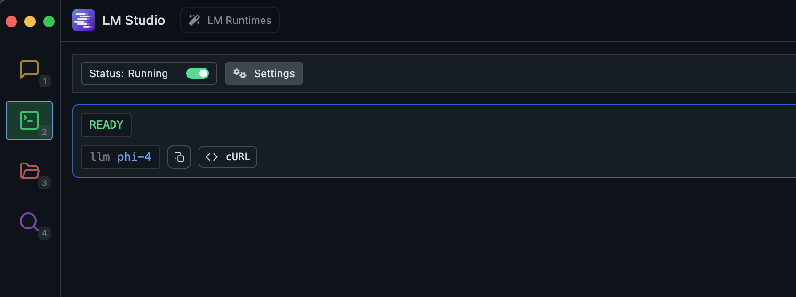

+++
title = "LM Studio와 함께 Noir 사용하기"
description = "코드 분석을 위해 로컬 언어 모델을 실행하기 위해 Noir를 LM Studio와 통합하는 방법을 알아보세요. 이 가이드는 LM Studio 서버를 설정하고 Noir에 연결하는 방법을 보여줍니다."
weight = 3
sort_by = "weight"

[extra]
+++

[LM Studio](https://lmstudio.ai)는 로컬 컴퓨터에서 대규모 언어 모델(LLM)을 쉽게 다운로드하고 실행할 수 있게 해주는 인기 있는 애플리케이션입니다. Noir를 LM Studio와 통합하면 코드를 제3자 서비스로 전송하지 않고도 AI 기반 코드 분석의 이점을 얻을 수 있습니다.

## LM Studio 설정

Noir와 함께 LM Studio를 사용하려면 먼저 애플리케이션을 다운로드하고 로컬 추론 서버를 시작해야 합니다.

1.  **LM Studio 설치**: [공식 웹사이트](https://lmstudio.ai)에서 LM Studio를 다운로드하고 설치하세요.
2.  **로컬 서버 시작**: LM Studio를 열고 모델을 선택한 다음 "Local Server" 탭으로 이동하세요. "Start Server"를 클릭하여 로컬 API 엔드포인트를 통해 모델을 사용할 수 있게 만드세요.

    

## LM Studio와 함께 Noir 실행

LM Studio 서버가 실행 중이면 `lmstudio` AI 제공자를 사용하여 Noir를 연결할 수 있습니다.

```bash
noir -b ./spec/functional_test/fixtures/hahwul \
     --ai-provider=lmstudio \
     --ai-model <MODEL_NAME>
```

`<MODEL_NAME>`을 LM Studio에서 서빙하고 있는 모델의 이름으로 바꾸세요. 그러면 Noir가 발견된 엔드포인트를 분석을 위해 로컬 서버로 전송합니다.

이 설정은 데이터에 대한 완전한 제어권을 제공하여 AI를 코드 분석에 활용하는 강력하고 비공개적인 방법을 제공합니다.