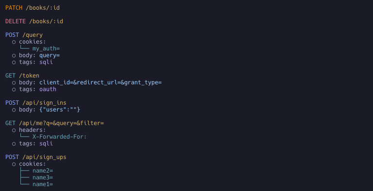

+++
title = "Using the Tagger for Contextual Analysis"
description = "Learn how to use Noir's Tagger feature to automatically add contextual tags to endpoints and parameters. This can help you quickly identify interesting or potentially vulnerable areas of your application."
weight = 3
sort_by = "weight"

[extra]
+++

The Tagger is a powerful feature in Noir that automatically adds descriptive tags to the endpoints and parameters it discovers. These tags can provide valuable context about the functionality or potential security risks associated with a particular part of your application. This helps you quickly focus your attention on the areas that matter most.

For example, the Tagger can identify parameters that might be vulnerable to SQL injection, or endpoints that are related to authentication.



## How to Use the Tagger

The Tagger is disabled by default. You can enable it in a few different ways:

*   **Enable all taggers**: To run all available taggers, use the `-T` or `--use-all-taggers` flag.

    ```bash
    noir -b <BASE_PATH> -T
    ```

*   **Enable specific taggers**: If you only want to run certain taggers, you can specify them with the `--use-taggers` flag. You can find a list of all available taggers by running `noir --list-taggers`.

    ```bash
    noir -b <BASE_PATH> --use-taggers hunt,oauth
    ```

## Understanding the Output

When you use the Tagger, the tags will be included in the output. If you are using the JSON or YAML formats, the tags will be added to the `tags` array for each endpoint and parameter.

Here is an example of what the JSON output looks like with tags:

```json
{
  "url": "/query",
  "method": "POST",
  "params": [
    {
      "name": "query",
      "value": "",
      "param_type": "form",
      "tags": [
        {
          "name": "sqli",
          "description": "This parameter may be vulnerable to SQL Injection attacks.",
          "tagger": "Hunt"
        }
      ]
    }
  ],
  "protocol": "http",
  "tags": []
},
{
  "url": "/token",
  "method": "GET",
  "protocol": "http",
  "tags": [
    {
      "name": "oauth",
      "description": "Suspected OAuth endpoint for granting 3rd party access.",
      "tagger": "Oauth"
    }
  ]
}
```

By using the Tagger, you can enrich your scan results with valuable context, making it easier to understand your application and prioritize your security efforts.
